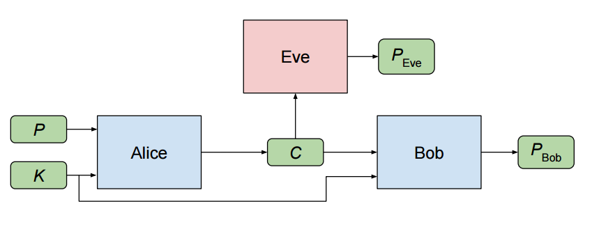

# Adversarial Neural Cryptography in [TensorFlow](https://github.com/tensorflow/tensorflow)

A Tensorflow Flow implementation of Google Brain's recent paper ([Learning to Protect Communications with Adversarial Neural Cryptography.](https://arxiv.org/pdf/1610.06918v1.pdf))

Two Neural Networks, Alice and Bob learn to communicate secretly with each other, in presence of an adversary Eve.

## Pre-requisites

* TensorFlow 
* Seaborn (for plots)
* Numpy

## Usage 
First, ensure you have the dependencies installed.

    $ pip install -r requirements.txt

To train the neural networks, run the `main.py` script.

    $ python main.py --msg-len 32 --epochs 50
    
    
## Attribution / Thanks

* carpedm20's DCGAN [implementation](https://github.com/carpedm20/DCGAN-tensorflow) in TensorFlow. 
* Liam's [implementation](https://github.com/nlml/adversarial-neural-crypt) of Adversarial Neural Cryptography in Theano. 

## License

MIT
